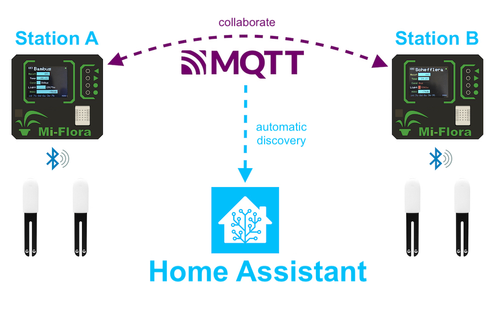

MiFlora Receiver Base Station
===

This project aims to create a mesh of distributed BLE trackers, to work as stations that continuously collect data from XIAOMI MiFlora devices, and silently collaborate via MQTT to show all their characteristics on a physical TFT display, whether they are in direct range, or not.

It integrates seemingless with **Home Assistant** via automated discovery, so you don't need to modify any configuration file to integrate it, you only need the MQTT broker to be properly configured.

Hardware
===
This project is desgined to work only with ESP32 modules, given their built-in WiFi and BLE capabilities.

BOM
---
* 1 x DFROBOT Firebeetle ESP32 V4 (or any other ESP32 board, check hardware pinout)
* 1 x 128 x 160 SPI TFT display with the ST7735 driver
* 4 x GPIO buttons panel
* 1 x DHT22 temperature and humidity sensor
* 2 x WS2812 neopixel LEDs (optional)
* 1 x 1S LiPo battery (optional)
* 1 x NPN BC547 tranzistor + 1 x 1K rezistor for turning off the display (optional)

Configuration
===

Station
---
Configuration for a station can be done in two ways:
* at compile time, using the [include/default_config.h](/include/default_config.h) include file;
* at run-time, using the [data/config.cfg](data/config.cfg.sample) file stored on the SPIFFS partition.

The [data/config.cfg](data/config.cfg.sample) overrides the compile-time configuration, and it's useful for programming multiple stations with the same generic firmware binary, while keeping a given set of options specific to that station (e.g.: the station's name).

Plants
---
For configuring your plants, check the [data/devices.cfg](data/devices.cfg) SPIFFS file.

This file allows you to give each plant a name, an unique ID and the limits for each monitored characteristic (like minimum moisture, or maximum temperature).

Manual
===
Check out the [device manual](./MANUAL.md) for more information.

(*work in progress*)

Credits
===
* Internal task scheduling is based on the [Task Scheduler](https://github.com/arkhipenko/TaskScheduler) library created by Anatoli Arkhipenko.
* Parsing advertising data from was inspired from [ESPHome's](https://esphome.io/components/sensor/xiaomi_ble.html) `xiaomi_hhccjcy01` platform implementation.

Licence
===
This project is under the **MIT Licence** for use and distribution.