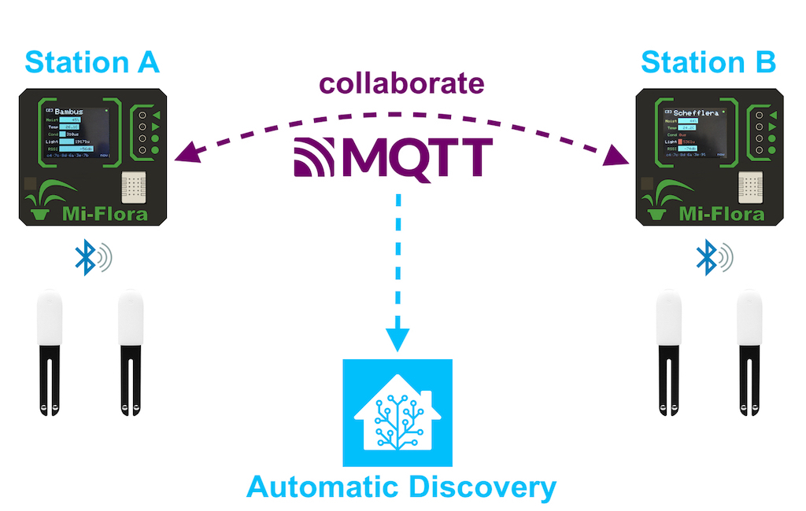

MiFlora Receiver Base Station
===

This project aims to create a mesh of distributed BLE trackers, to work as stations that continuously collect data from XIAOMI MiFlora devices, and silently collaborate to show all their characteristics on a physical TFT display.

The stations integrates easily with **Home Assistant** via automated discovery and **you need to configure nothing**! The stations will publish a central device in **HA** where all the entities for all the plants that you monitor with MiFlora are updated in colaboration, using MQTT. 

Hardware
===
This project is based on an ESP32 module for its built-in WiFi and BLE capabilities.

The BOM is simple:
* 1 x DFROBOT Firebeetle ESP32 V4 (or ny other ESP32 board, check hardware pinout)
* 1 x 128 x 160 SPI TFT display with the ST7735S driver
* 4 x GPIO buttons
* 1 x DHT22 temperature and humidity sensor
* 2 x WS2812 neopixel LEDs (optional)
* 1 x 1S LiPo battery (optional)
* 1 x NPN BC547 tranzistor + 1 x 1K rezistor for turning off the display (optional)

Configuration
===
*To be done*

Licence
===
This project is under the **MIT Licence** for use and distribution.